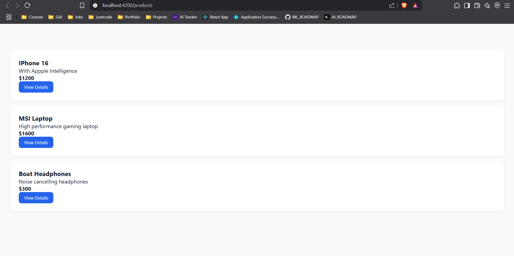
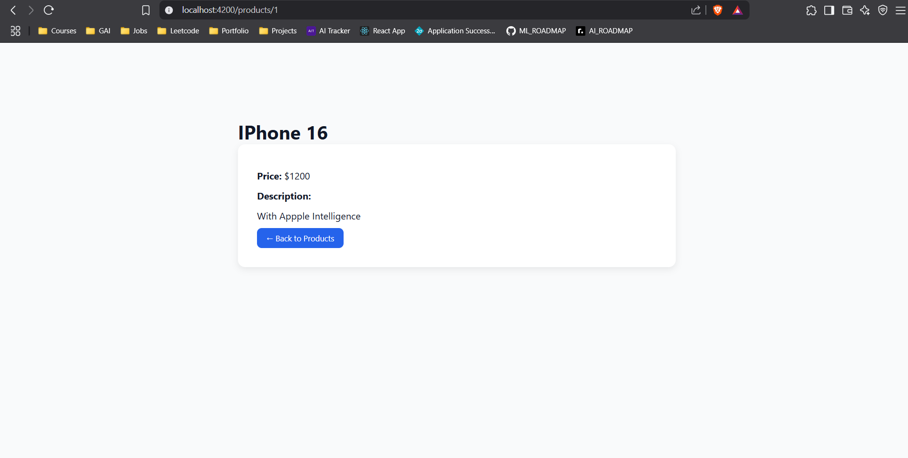

# Product App

A simple Angular application that demonstrates component-based architecture, routing, services, and data binding.

## 🚀 Project Overview

This project was built as part of a Front End Engineer assessment and includes:

- A `ProductCardComponent` that displays product details with data binding.
- A `ProductListComponent` that lists all products from a service.
- A `ProductDetailComponent` for viewing individual product details.
- Angular routing configured with navigation between product list and product details.
- Styling for a clean, responsive interface.

## 🛠️ Tech Stack

- Angular 17
- TypeScript
- RxJS for Observables
- CSS

## 📦 Installation

```bash
git clone https://github.com/SurryaT10/product-app.git
cd product-app
npm install
ng serve
```

## 🖼️ Screenshots
Product List Component


Product Detail Component


## 📌 Features
✅ Angular CLI setup with routing

✅ Product card with @Input() and @Output()

✅ Data service using Observables

✅ Routing with dynamic route for product details

✅ Simple and responsive UI

## 👨‍💻 Author
Surrya Thangamuthu